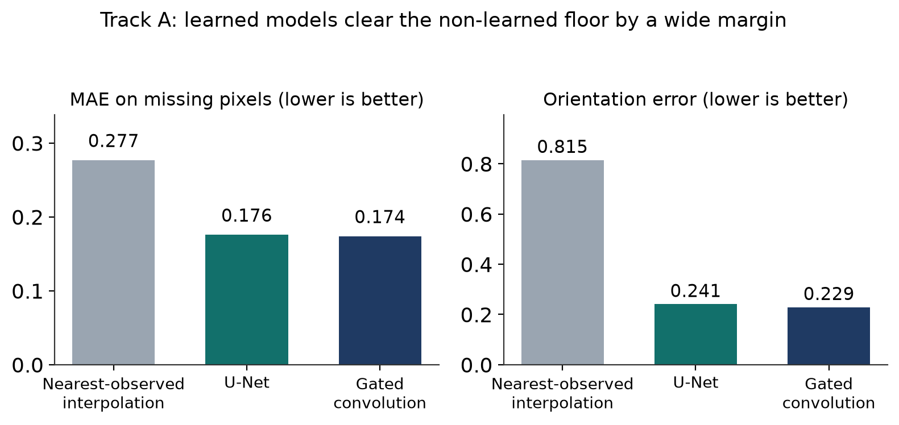
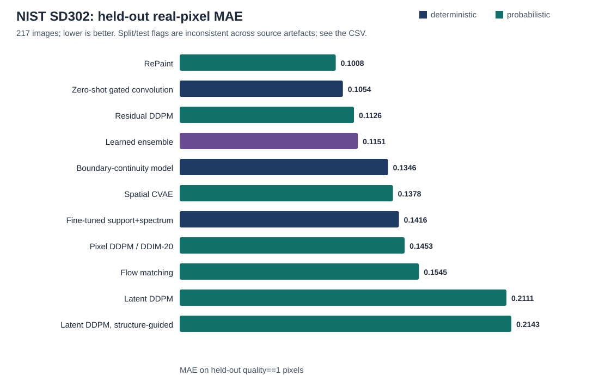
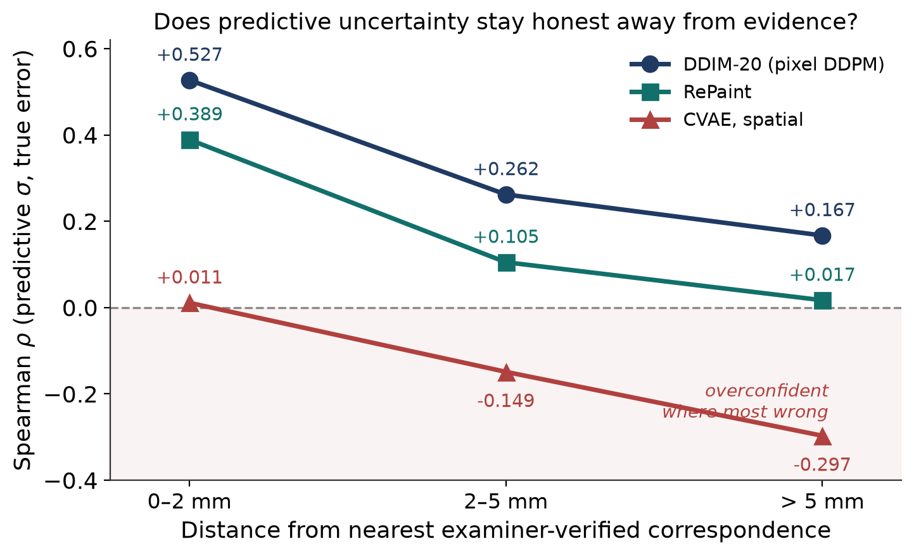
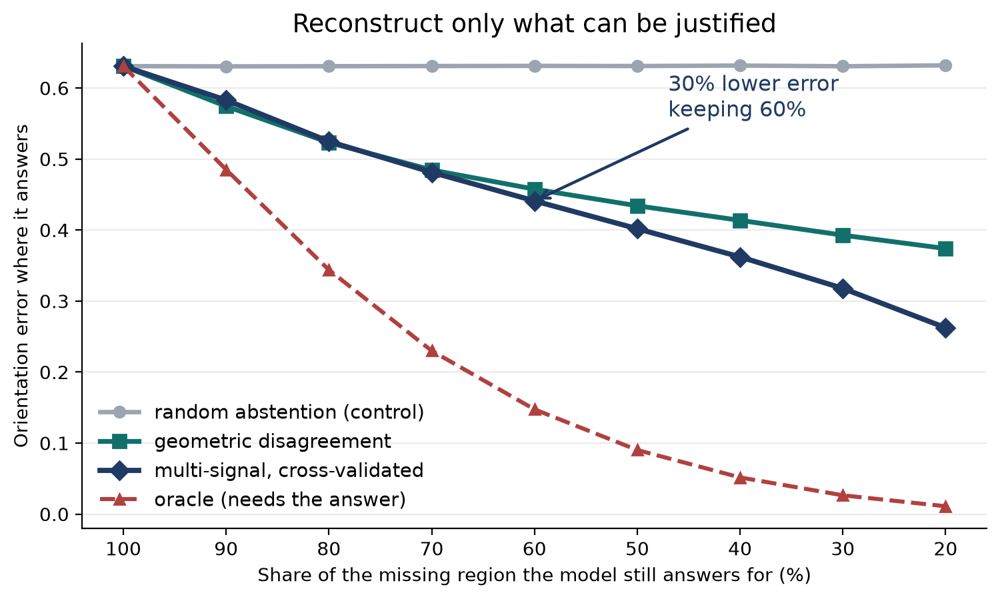

# Current quantitative results

This directory now contains generated research outputs rather than empty
placeholders. Rebuild them with:

```bash
python3 scripts/build_curated_results.py
python3 scripts/build_results_catalog.py
```

## SOCOFing controlled reconstruction

The subject-disjoint validation comparison contains 900 images. Metrics are
computed primarily on missing pixels intersected with the fingerprint ROI.
Gated convolution improves slightly over U-Net on MAE, PSNR, SSIM, and axial
orientation error; the paired effects are statistically detectable but not a
qualitative solution to severe missing-ridge reconstruction.



Exact values: [`tables/socofing_deterministic_baselines.csv`](tables/socofing_deterministic_baselines.csv).

## NIST SD302 held-out real-pixel evaluation

The table evaluates models on held-out `quality==1` pixels. These are faint or
debatable ridge-flow pixels, not truly absent ground truth. Therefore the task
is real-latent enhancement under partial evidence, not proof of recovery of an
unobserved person's true ridge pattern.



Exact values: [`tables/nist302_heldout_evaluation_217.csv`](tables/nist302_heldout_evaluation_217.csv).

The current source directories use the prefix `nist302_TEST_FINAL`, but their
internal provenance flags are inconsistent: several report `split=validation`
and `test_loaded=false`, while the CVAE artefact reports `test_loaded=true`
without a `split` field. The CSV preserves these fields row by row. This
summary therefore calls the 217-image set a held-out evaluation split. It must
not be described globally as an external or sealed final test until the split
provenance is reconciled.

## Predictive uncertainty

Uncertainty localization weakens as evaluation moves farther from
examiner-verified correspondence points. DDIM remains positively associated
with error across the reported distance strata, while the CVAE correlation
becomes negative far from verified evidence.



Increasing K stabilizes uncertainty estimates more than predictive-mean
fidelity. Exact DDIM and residual-DDPM values for K=10,20,50 are in
[`tables/nist302_k_sensitivity.csv`](tables/nist302_k_sensitivity.csv).

## Selective reconstruction

Abstention uses a reliability score to decline reconstruction in regions where
the model is least defensible. This does not improve the generated pixels; it
restricts the region over which an answer is offered.



## Inferential results and compute

- [`statistics/selected_paired_tests.csv`](statistics/selected_paired_tests.csv)
  consolidates paired effects, 95% confidence intervals, Cohen's dz, paired
  t-tests, and Holm-adjusted Wilcoxon p-values from the source JSON files.
- [`statistics/nist302_friedman_omnibus.json`](statistics/nist302_friedman_omnibus.json)
  records the repeated-measures omnibus comparison across six models.
- [`tables/compute_cost.csv`](tables/compute_cost.csv) records measured model
  size, training time, and sampling cost where available.

These files report observations, not guarantees of fingerprint identity or
ground-truth recovery. Best-of-K is an oracle-assisted diagnostic and must not
be presented as single-sample performance.
